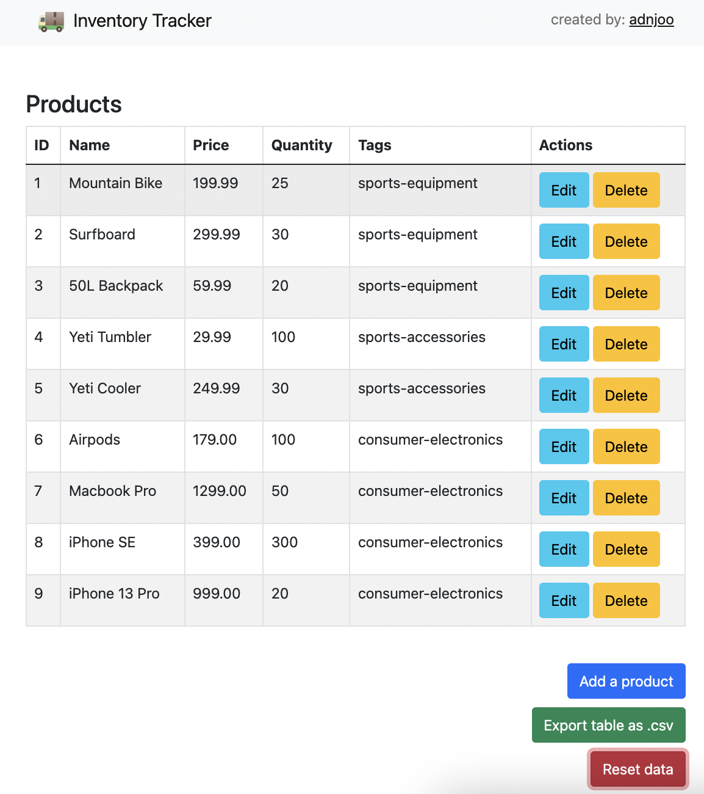
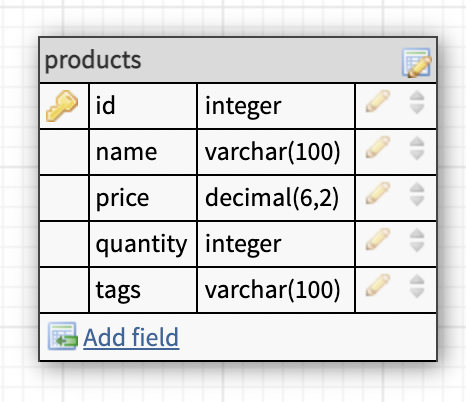

<!-- PROJECT LOGO -->
<br />
<p align="center">
  <a href="https://github.com/adnjoo/inventory-tracker">
    
  </a>

  <h2 align="center">Inventory Tracker</h2>

  <p align="center">
    This application allows you to track products in your inventory. You can add, remove, and update products. You can also export products into a .csv file. 
    <br />
    <br />
    <br />
  
  </p>
</p>

## Built With:

* Next.js

* PostgreSQL

* Node

* Express

* Cypress (E2E testing | Front End)

* Jest (Unit Testing | Back End)

# Instructions:

## Front End:

```
git clone https://github.com/adnjoo/inventory-tracker
cd inventory-tracker
cd client
npm install
npm run dev
```

## Back End:

```
cd server
npm install
node start
```

## Run Tests (Front End):

```
cd client
npm run cypress:run
```

## Run Tests (Back End):

```
cd client
npm run test
```

## DB Model


